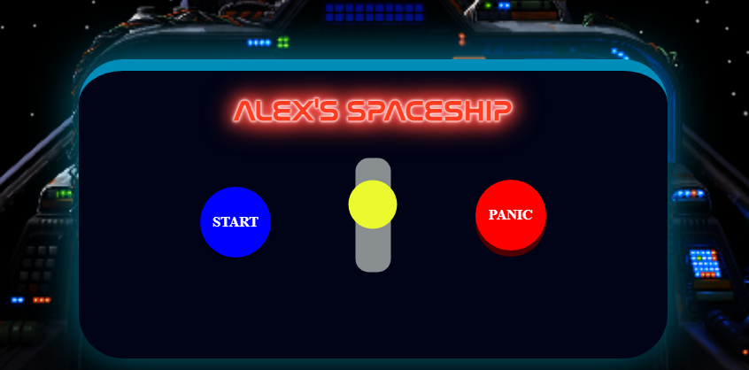
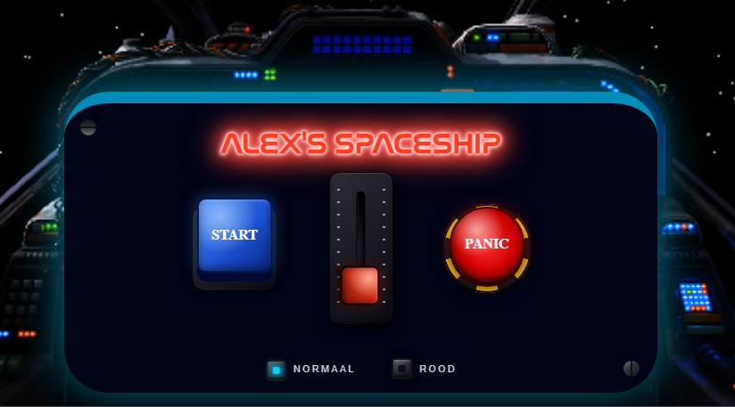

<h1>Daily en Weekly Checkouts</h1>

<h2>Dag 1 (18/02/2025) Woensdag</h2>

<h3>Wat heb ik gedaan vandaag?</h3>

De dag begon met de introductie van CSS, de introductie duurt anderhalve dag. Ik heb de artikels gelezen die bij ons onderwep gelinkt waren. Ik vond ze heel interessant. Het verbaasd me hoeveel CSS je tegenwoordig helpt op verschillende browsers. Wij hadden het onderwerp Carousels. Een aantal jaren terug, herinner ik me dat ik een opdracht had waar ik een Carousel voor moest maken. En toen vond ik het heel ingewikkeld. Het moest met heel veel regels Javascript, terwijl het nu allemaal mogelijk is met CSS en HTML. We hebben een een simpele versie van een carousel gemaakt, en een ingewikkelde. Om te laten zien hoe makkelijk het eigenlijk is om de simpelste carousel te maken. Verder hebben we ook een powerpoint gemaakt, waarin we vertellen wat een carousel is, waar we verder op stukjes code ingaan. En waar we diverse carousels laten zien die misschien nog te ingewikkeld zijn voor nu.

<h3>Hoelang heb ik eraan gewerkt?</h3>

Lezen van Artikels: 1 uur

Simpele Carousel: 1 uur

Ingewikkelde Carousel: 2 uur

Check-Out: 1 uur

<h3>Wat heb ik geleerd?<h3>

Ik heb eigenlijk heel veel geleerd over Carousels. Het was voorheen hele andere code dan nu. Ik heb de basis geleerd van Carousels, Maar ook wat meer advanced opties zoals de scroll marker group.

<h3>Wat ga ik morgen doen?</h3>

Morgen ga ik nog even de presentatie voorbereiden, wat aantekeninkjes maken, en presenteren. Verder ben ik benieuwd naar wat voor feedback we krijgen. Ten slotte ga ik de uitleg volgen voor de css opdracht. 

<h2>Dag 2 (19/02/2025) Donderdag</h2>

<h3>Wat heb ik gedaan vandaag?</h3>

Vandaag ging het heel snel. We begonnen de dag met voorbereidingen voor de presentaties. We hadden nog een uurtje om te werken aan een powerpoint. En daarna mochten we presenteren. Ik heb van medestudenten heel veel nieuwe begrippen geleerd. En er zijn me een aantal wel bijgebleven, bijvoorbeeld over de containers, en hoe je de style attribuut gebruikt. Daarna hebben we uitleg gekregen over het eindproject CSS. We hadden even de tijd om te kiezen. Ik vond het leuk om mee te doen met de rekensommen van medestudenten. Ik zat een tijdje te twijfelen, en uiteindelijk heb ik voor de controlpanel opdracht gekozen. Ik heb toen gebrainstormd over verschillende control panels. En ik heb vervolgens schetsen gemaakt. Ik ben uiteindelijk tot een conclusie gekomen om de control panel van een ruimteschip te maken. Daarbij wil ik een start/stop knop. Een rode knop, waarbij een alarm afgaat als je erop drukt. en een throttle slider om langzamer of harder te gaan. 

<h3>Hoelang heb ik eraan gewerkt?</h3>

Presentatie voorbereiden: 1 uur

Presentatie Geven en Volgen: 2 uur

Uitleg CSS: 1 uur

Brainstormen en Schetsen: 2 uur

Check-Out: 1 uur

<h3>Wat heb ik geleerd?<h3>

 Ik heb niet alleen veel dingen geleerd over mijn eigen onderwerp, maar ook over de onderwerpen van medestudenten. Verder heb ik onderzoek gedaan naar de verschillende wegen die je kunt nemen voor deze opdracht. Ook heb ik onderzoek gedaan naar wat ik wil gaan doen.

<h3>Wat ga ik morgen doen?</h3>

Morgen is de wekelijkse voortgangsgesprek. Die ga ik volgen en verder wil ik kijken wat voor feedback ik krijg op mijn plan.

<h2>Weekly Checkout 1</h2>
<h3>Wat heb je deze week gedaan?</h3>

Ik heb gewerkt aan de introductie van het vak CSS.Ik moest samen met mijn groepje een presentatie voorbereiden over Carousels. Ik heb artikelen gelezen en zowel een simpele als een geavanceerde carousel gebouwd. Daarnaast heb ik een presentatie gemaakt en gegeven. Op dag twee heb ik kennis opgedaan uit presentaties van anderen en ben ik gestart met het echte project. Ik twijfelde nog even maar ik heb toch gekozen voor een control panel. Ik dacht even na over wat voor control panel, toen kwam ik op een ruimteschip en hiervoor heb ik gebrainstormd en schetsen gemaakt.

<h3>Wat heb je deze week geleerd?</h3>

Ik heb geleerd hoe je carousels bouwt met moderne CSS in plaats van veel JavaScript. Ook heb ik nieuwe concepten geleerd van medestudenten en kennis opgedaan over het nieuwe project, en daarvoor gebrainstormt en schetsen gemaakt.

<h3>Wat ga je volgende week doen?</h3>

Ik ga verder met mijn control panel, feedback verwerken en starten met het bouwen van de eerste onderdelen in CSS.

<h2>Dag 3 (04/03/2025) Woensdag</h2>

<h2>Wat heb ik gedaan vandaag?</h2>

Vandaag was een productieve dag. De dag begon met een Weekly Geek namelijk, Nils Binder. Dit was een korte introductie over wie hij was, wat zijn functie is bij het bedrijf waar hij werkt, en hoe hij CSS gebruikt. Na de Weekly Geek heb ik ook de workshop van Nils gevolgd, die ging over flexbox. Hier heb ik een aantal trucjes geleerd zoals flex-wrap en flex-grow. Na de workshop heb ben ik begonnen met mijn ontwerp. Ik ben vandaag trots op wat ik heb gedaan. Ik heb met divs laagjes sterren gemaakt, die heb ik met transparantie en verschillende groottes een 3d achtig effect kunnen geven, met transform. Ook heb ik een range slider gemaakt waarmee ik de snelheid aan kan passen. Sanne heeft mij geholpen met getalletjes uitkiezen zodat deze beweging wordt gerandomized. 

<h3>Hoelang heb ik eraan gewerkt?</h3>

Weekly Geek: 1 uur

Workshop flexbox: 1 uur

Animatie: 3 uur

Check-Out: 1 uur

<h3>Wat heb ik geleerd?<h3>

Vandaag heb ik best wel veel geleerd. Ik heb een aantal trucjes met flexbox geleerd. Ook heb ik geleerd hoe ik een animatie maak met animation delay en duration. En hoe ik die koppel aan value's op een range slider.

<h3>Wat ga ik morgen doen?</h3>

Morgen wil ik aan de slag met de vormgeving van mijn ruimteschip/dashboard

<h2>Dag 4 (05/03/2025) Donderdag</h2>

<h3>Wat heb ik gedaan vandaag?</h3>

 Vandaag ging de dag best snel. Ik ben begonnen met het verbeteren van mijn 3d animatie, hoe ik de animatie had gedaan was niet optimaal zei Sanne. Ik maakte eerst sterrenlagen met transparantie om zo een neppe 3d animatie te maken eigenlijk. En hij heeft mij geleerd hoe ik dat met een echte 3d animatie moest doen. Ik heb  Daarna heb ik een workshop gevolgd van Nils, die ging over svg. Hij liet zien hoe een SVG werkt, hoe je bespaart op ruimte, en hoe je een SVG aanpast door middel van code. Ik vond dit best handig om te weten. Daarna ben ik zelf begonnen met een SVG zoeken die ik kan gebruiken als cockpit. Ik had een idee om een SVG te gebruiken die transparante ramen heeft, zodatik daar de sterrenlagen door kan zien. Na even gezocht te hebben heb ik de svg laten comprimeren op de site die Nils mij heeft laten zien en was ik aan de slag gegaan met het positioneren daarvan, hier was ik wel even mee bezig maar uiteindelijk is het gelukt. Ik heb de SVG een fixed position gegeven en een backround-size cover zodat hij over de hele beeldscherm is.

<h3>Hoelang heb ik eraan gewerkt?</h3>

3D animatie verbeteren: 2 uur

Workshop Nils: 1 uur

SVG: 2 uur

Check-out: 1 uur

<h3>Wat heb ik geleerd?<h3>

Ik heb geleerd hoe je een 3D animatie moet maken, ook heb ik geleerd hoe ik de perspective, delay en duration moet aanpassen. En tijdens de workshop van Nils heb ik geleerd hoe een SVG werkt.

<h3>Wat ga ik morgen doen?</h3>

Morgen wil ik kijken naar hoe ik deze animatie realistischer kan maken, en hoe ik dat ga laten werken met mijn range slider. Ook wil ik misschien een start knop maken

<h2>Weekly Checkout 2</h2>
<h3>Wat heb je deze week gedaan?</h3>

Ik heb kennis opgedaan over flexbox en svg's bij workshops die ik heb gevolgd. Ook ben ik begonnen met mijn project, de eerste week was vooral nadenken over wat ik wil maken, maar deze week moest ik hard aan de slag. Ik heb een sterren-animatie gemaakt met een 3D-effect en een range slider gekoppeld om de snelheid aan te passen. Ook heb ik mijn animatie verbeterd door echte 3D-transforms te gebruiken in plaats van een nep-effect. Daarnaast heb ik een SVG cockpit gevonden, geoptimaliseerd en positie gegeven, zodat het het hele scherm bedekt.

<h3>Wat heb je deze week geleerd?</h3>

Flexbox is iets wat altijd lastig blijft, doordat er zo veel dingen zijn waar je iets mee kunt doen. Deze week heb ik nieuwe technieken geleerd, zoals flex-wrap en flex-grow. Ook heb ik geleerd hoe ik animaties maak en aanpas met duration en delay, en hoe ik deze koppel aan input zoals een slider, door middel van het stukje js code van Sanne. Verder heb ik geleerd hoe echte 3D-animaties werken en hoe ik SVG's kan gebruiken en optimaliseren.

<h3>Wat ga je volgende week doen?</h3>

Ik ga mijn animatie verder realistischer maken, deze beter koppelen aan de slider en beginnen met het toevoegen van interactieve elementen zoals een startknop, of een panic knop

<h2>Dag 5 (11/03/2025) Woensdag</h2>

<h3>Wat heb ik gedaan vandaag?</h3>

 Vandaag begon de dag met een lezing van Sanne over Kleurengebruik. Hij liet zien hoe kleurcodes eigenlijk in elkaar zitten. Eerst wist ik niet hoe ik zelf kleuren kon mengen, door middel van de codes aan te passen, maar nu weet ik dat wel. Door de 2 voorbeelden die hij gaf met HUE en RGB weet ik nu ook hoe die in elkaar zitten. Daarna ben ik even bezig gegaan met mijn eigen code, ik heb proberen te spelen met de perspective en de 3d animatie, om die smoother te laten werken. En hij is nu wel ietsjes beter. Ook heb ik elke laagje sterren eenbeetje laten draaien, zodat het nog meer random is. Daarna ben ik aangeschoven bij de workshop van Sanne, die ging over container style querie. Hij heeft laten zien hoe je zo een style preset maakt eigenlijk. Ik heb nu wel een idee van hoe het in zijn werking gaat, maar moet ik nog bedenken wat voor stijl ik wil maken aan mijn cockpit. Na de workshop heb ik gezocht naar bronnen hoe je een checkbox realistisch maakt, en ik ben iets heel interessants tegengekomen. Ik heb nu een button gemaakt waarbij je eerst een klepje van open moet doen, voordat je op de button kan drukken. Ik heb wel eenbeetje gecheat door een click eventlistener in javascript te gebruiken, maar ik ben er alsnog trots op.

<h3>Hoelang heb ik eraan gewerkt?</h3>

Lezing: 1 uur

3D Animatie: 1 uur

Workshop: 1uur

Button: 3 uur

Check-Out: 1 uur

<h3>Wat heb ik geleerd?<h3>

Ik heb geleerd hoe kleurcodes in elkaar zitten, en hoe ik kleurcodes aan kan passen om kleuren te mengen. Ook heb ik geleerd hoe ik style queries moet maken, en hoe ik checkboxes style tot een realistische button.

<h3>Wat ga ik morgen doen?</h3>

Morgen wil ik aan de slag met de range input, en een kleine achterstand van mijn ReadMe inhalen.

<h2>Dag 6 (12/03/2025) Donderdag</h2>

<h3>Wat heb ik gedaan vandaag?</h3>

Vandaag begon de dag met een kleine intro. Daarna ben ik bezig gegaan met de range imput iets realistischer maken, dit heb ik gedaan door de thumb een rondje te maken, dat groter is dan de slider track. Zo lijkt het alsof je een pokeje hebt. Ook heb ik een checkbox toegevoegd voor een animatie die ik later wil maken. Verder heb ik de indeling van de Cockpit moeten aanpassen zodat 3 inputs op een rij passen. Ik heb mijn button aan Sanne en Vasilis laten zien, en die zeiden dat het niet mocht omdat ik een paar regels js heb gebruikt. Dus heb ik geprobeerd om dit alleen te doen door middel van html en css. Sanne heeft me uitgelegd dat ik dat moet doen door middel van 2 checkboxen op elkaar, en als je op de eerste checkbox klikt, dat de tweede dan pas klikbaar is. Dus probeerde ik het. Ik was uiteindelijk zo lang bezig dat de dag me voorbij was gegaan. Het is me niet gelukt, doordat er zo veel selectoren zijn dat ik helemaal vast liep. Maar soms leer je ook van je fouten. Ik ben blij dat ik het tenminste heb geleerd. 

<h3>Hoelang heb ik eraan gewerkt?</h3>

Intro: 0.5 uur

Slider: 1.5 uur

Checkbox en Indeling cockpit: 1 uur

Button fixen: 3 uur

Check-Out: 1 uur

<h3>Wat heb ik geleerd?<h3>

Ik heb geleerd wat wel de juiste manier is om een klep te maken die bovenop je knop komt te staan, alleen vond ik het nog te lastig om zelf toe te passen. Ook heb ik geleerd hoe je een slider iets realistischer maakt.

<h3>Wat ga ik morgen doen?</h3>

Doordat ik 2 dagen heb verspild aan de button moet ik morgen echt een inhaalslag maken. Morgen wil ik mijn dashboard aanpassen, kijken naar nesting, iets doen met een lettertype,  en misschien nog een nieuwe animatie erbij.

<h2>Weekly Checkout 3</h2>
<h3>Wat heb je deze week gedaan?</h3>

Ik heb door Sanne mijn kennis verbreed over kleurgebruik en geleerd hoe HUE en RGB werken, Zijn 2 voorbeelden in codepen maakte het voor mij wel duidelijker over hoe de kleuren in elkaar zitten. Daarna heb ik mijn 3D-animatie verbeterd en extra effecten toegevoegd. Ook heb ik een workshop gevolgd over container style queries. Verder heb ik gewerkt aan interactieve elementen van mijn cockpit, zoals een realistische knop met een klep en een verbeterde range slider. Alleen had ik een klein stukje javascript gebruikt, wat niet mocht. Ik heb geprobeerd deze knop zonder JavaScript te maken, maar dat vond ik lastig en is nog niet gelukt. Ik vind dat best jammer, maar uiteindelijk heb ik er toch veel van geleerd.

<h3>Wat heb je deze week geleerd?</h3>

Ik heb geleerd hoe kleurcodes werken en hoe ik kleuren kan aanpassen. Ook heb ik meer inzicht gekregen in 3D-animaties, style queries en het realistischer maken van elementen zoals sliders en knoppen. Daarnaast heb ik geleerd hoe je een oplossing zonder JS zou kunnen aanpakken, ook al lukte het nog niet volledig.

<h3>Wat ga je volgende week doen?</h3>

Ik heb nu al best veel tijd aan de knop verspild/verbruikt, dus ga ik de klep op de knop even aan de kant schuiven, en een inhaalslag maken door verder te werken aan mijn dashboard, nesting, een passend lettertype kiezen en nog een extra animatie toevoegen, als ik er tijd voor heb.

<h2>Dag 7 (18/03/2025) Woensdag</h2>

<h3>Wat heb ik gedaan vandaag?</h3>

Vanmorgen begon ik even met een besef momentje dat ik nog even moet bikkelen. Doordat ik 2 dagen heb verspild aan de klepje, heb ik besloten om dat voor nu even achterwegen te laten en door te gaan. Natuurlijk was ik eenbeetje teleurgesteld dat het mij niet is gelukt om alleen met html en css te doen. Maar ik ben nogsteeds trots op mezelf dat ik het heb geprobeerd, en uiteindelijk heb ik toch best wel veel erover geleerd. Net als hoe ik de klep moet positioneren, en hoe ik hem een transitie moet geven om dat openklap look-and-feel te geven. Ik heb mijn dashboard aangepast. ik heb het nu meer een futuristische look gegeven, ook heb ik de svg aangepast omdat ik hem toch niet zo mooi vond. Ik heb nu een mooiere gevonden naar mijn mening.,kkk Ik besloot om vandaag aan de slag te gaan met de Lettertype. Ik dacht even na over wat voor lettertype zou passen bij een ruimteschip. Na even nagedacht te hebben vond ik het een leuk idee om de nasa lettertype te gebruiken, omdat het een best iconisch en herkenbare lettertype is. Omdat ik mijn dashboard in de stijl van neon en futuristisch heb gemaakt had ik ook het idee om een Neon Sign animatie te maken voor mijn lettertype. Ook ben ik bezig geweest met mijn tweede stijl. Ik heb een form met radio buttons gemaakt waarbij ik een optie de normale is en de andere rood. Bij de rode optie wil ik dat de sterren rood worden in plaats van wit en dat de dashboard ook rood wordt in plaats van blauw. Ten slotte ben ik bezig geweest met CSS Nesting. Ik heb een artikel op MDN bestudeerd die hierover ging. En hieruit leerde ik dat je normale css nesting hebt en ook scss nesting, hier was ik nog niet helemaal klaar mee.

<h3>Hoelang heb ik eraan gewerkt?</h3>

Lettertype: 3uur

Stijl: 2 uur

Nesting 1 uur

Check-Out: 1 uur

<h3>Wat heb ik geleerd?<h3>

Ik heb veel over nesting geleerd. Dat je met > de parent niet meer hoeft op te schrijven bij nesten. Wat mij wel is opgevallen is dat dit misschien te nieuw is voor validatiors, want ik krijg steeds errors hiervan, terwijl de code eigenlijk gewoon werkt. Ook heb ik een opfrissertje gehad over hoe je een font inlaad. En heb ik geleerd hoe je met has: een tweede stijl kan maken.  

<h3>Wat ga ik morgen doen?</h3>

Morgen wil ik nog een animatie toevoegen, namelijk de Panic Animatie., en wil ik ik verder kijken naar de nesting. Ten slotte wil ik de puntjes op de i zetten en de kleine achterstand in de Read-Me afmaken.

<h2>Dag 8 (19/03/2025) Donderdag</h2>

<h3>Wat heb ik gedaan vandaag?</h3>

Vandaag is voor mij de laatste dag, ik heb morgen mijn gesprek. Dus ik kan nog even door tot 6 uur, vandaag staan er nog een aantal dingen op de to-do list. Ik ben begonnen met het afmaken van mijn nesting. Ik heb geleerd dat je pseudo elementen niet kunt nesten, wat ik eigenlijk wel jammer vind. Verder ben ik bezig gegaan met het maken van nog een animatie. Ik wil dat als iemand op de panic button drukt, dat er dan een alarm licht verschijnt. Ik ben begonnen om de animatie te maken in codepen. De link hiervan zie je ook bij de bronnen. Ik vond dit best leuk om te doen. Daarna was het nog de taak om het toe te voegen aan mijn ruimteschip, dit was nog wel eens een uitdaging omdat je met meerdere selctoren te maken hebt, en omdat je geen classes en ids mag gebruiken wordt het wel wat lastiger. Verder ben ik bezig gegaan met de @container queries, dit is voor de eerste keer dat ik hiermee werk. Ik heb ervoor gekozen om mijn H1 kleiner te laten worden en dat de 2 woorden onder elkaar komen te staan als de container kleiner dan 600px wordt (mobile versie). Tenslotte heb ik een kleine achterstand ingehaald op mijn Read-Me en is het nu alleen tijd voor mijn gesprek morgen! 

<h3>Hoelang heb ik eraan gewerkt?</h3>

Nesting: 1 uur

Panic Animatie: 2 uur

Container: 2 uur

Puntjes op de i: 1 uur

Read-Me Afmaken: 1 uur

<h3>Wat heb ik geleerd?<h3>

Ik heb meer geleerd over nesting en hoe je @container queries gebruikt om bijvoorbeeld dingen kleiner te maken. Ook heb ik geleerd om een panic animatie te maken en te linken aan bestaande code.

<h3>Wat ga ik morgen doen?</h3>

Morgen ga ik het gesprek hebben.

<h2>Herkansing Check-Out</h2>

<h3>Gekregen Feedback</h3>

Theme's in de Cockpit zetten

Knoppen zijn net niet realistisch

Kijk beter naar responsiveness

De Cockpit is net geen cockpit!

<h3>Wat heb je gedaan?</h3>

Ik was het eens met de feedback van Sanne, maar ik was nogsteeds trots op wat ik tot nu toe had gemaakt. Zo was ik al blij met de sterren animatie, en de panic animatie. Ik heb heb zo veel mogelijk feedback proberen op te nemen in mijn herkansing. Ik was begonnen met responsiveness. Eerst passte de controlpanel niet lekker in de cockpit, en zag het eruit alsof het gewoon erop was geplakt. Ik ben weer opnieuw aan de slag gegaan met de container queries. Nu is de cockpit responsive, en lijkt het niet alsof het maar erop is geplakt. Ook heb ik mijn oog voor detail vergroot! Zo heb ik nagedacht over het vastmaken van de controlpanel met schroefjes. 1 schroef staat zelf schuin, dat vond ik persoonlijk best grappig. Ook is mijn oog voor detail bij de buttons ook heel erg vergroot. Ik heb dit keer mijn best gedaan om elke button zo realistisch mogelijk te maken. Waar ik het meest trots op ben is denk ik de panic button. De panic button heeft een rondje eromheen in de thema van zo een hazard lint. Persoonlijk vond ik dat heel bijpassend omdat het een knop is die je alleen in moet drukken als er een noodgeval is. Ook ben ik trots op de Throttle. Nu heb ik aan de zijkanten Notches, wat zo een slider veel realistischer maakt. Elke button heeft nu een unieke uitstraling, en lijkt alsog je ze echt indrukt, of sleept. Zie hieronder in de plaatjes het verschil! Nu heb ik echt het besef gekregen wat het vak CSS inhoudt, en ik hoop dat het nu wel een voldoende is!

<h3>Wat heb je geleerd?</h3>

Ik heb geleerd dat CSS niet alleen is om je objecten zomaar neer te zetten, maar dat elk kleine detail ervoor zorgt dat je product veel leuker wordt. Voor dit opdracht had ik niet verwacht dat ik blij zou zijn dat een schroefje schuin staat. :> 

<h2>Bronnen</h2>

https://forums.scifi-meshes.com/discussion/77919/wings-of-saint-nazaire-game-art-large-images/p3

https://redstapler.co/chernobyl-az-5-button-css-html/

https://prismic.io/blog/css-text-animations#4-matrix

https://developer.mozilla.org/en-US/docs/Web/CSS/Guides/Nesting

